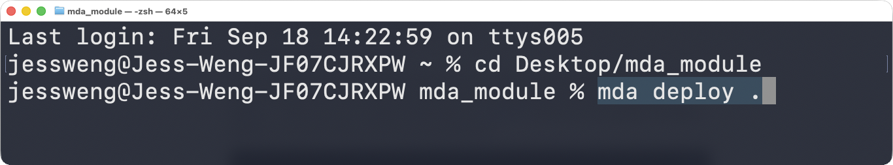
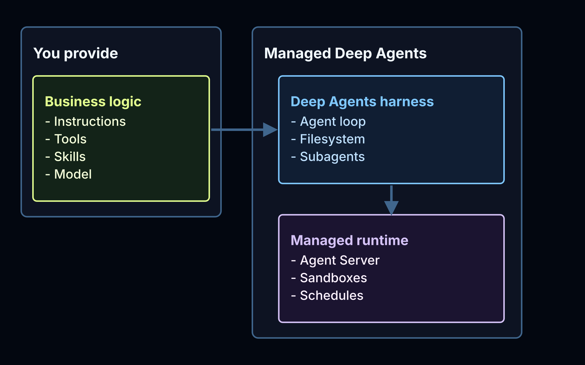

[For translation, open lesson in new tab and use Chrome translate](https://langchain-ai.github.io/lca-lessons/deepagents/m6/m6.1-what-is-managed-deep-agents.html)

<style>@import url('../shared/sd-components.css');</style>

# What Is Managed Deep Agents?

<div style="text-align:center;margin:2rem 0 2.5rem;">
  <p style="font-size:0.8rem;color:#40668D;font-family:'IBM Plex Mono',monospace;letter-spacing:0.07em;text-transform:uppercase;margin-bottom:0.75rem;">&#8595; click to celebrate &#8595;</p>
  <button id="get-started-btn" onclick="launchConfetti()" style="
    background: #fff;
    color: #000;
    border: 2px solid #000;
    border-radius: 12px;
    padding: 18px 48px;
    font-size: 1.3rem;
    font-weight: 700;
    font-family: 'IBM Plex Mono', monospace;
    cursor: pointer;
    letter-spacing: 0.04em;
    white-space: nowrap;
    box-sizing: border-box;
    box-shadow: 0 4px 18px rgba(0,0,0,0.15);
    transition: transform 0.15s, box-shadow 0.15s;
  "
  onmouseover="this.style.transform='scale(1.07)';this.style.boxShadow='0 6px 28px rgba(0,0,0,0.3)'"
  onmouseout="this.style.transform='scale(1)';this.style.boxShadow='0 4px 18px rgba(0,0,0,0.15)'"
  > Welcome to Managed Deep Agents</button>
</div>

<canvas id="confetti-canvas" style="position:fixed;top:0;left:0;width:100%;height:100%;pointer-events:none;z-index:9999;display:none;"></canvas>

<script>
(function () {
  var canvas, ctx, particles = [], running = false, animId;

  var COLORS = [
    '#006DDD','#3399FF','#7FC8FF','#CCE9FF','#60B0FF'
  ];

  function drawStar(ctx, cx, cy, spikes, outerRadius, innerRadius) {
    var rot = (Math.PI / 2) * 3, step = Math.PI / spikes;
    ctx.beginPath();
    ctx.moveTo(cx, cy - outerRadius);
    for (var i = 0; i < spikes; i++) {
      ctx.lineTo(cx + Math.cos(rot) * outerRadius, cy + Math.sin(rot) * outerRadius);
      rot += step;
      ctx.lineTo(cx + Math.cos(rot) * innerRadius, cy + Math.sin(rot) * innerRadius);
      rot += step;
    }
    ctx.lineTo(cx, cy - outerRadius);
    ctx.closePath();
    ctx.fill();
  }

  function Star(x, y) {
    this.x = x; this.y = y;
    this.vx = (Math.random() - 0.5) * 1.5;
    this.vy = 1.5 + Math.random() * 2;
    this.gravity = 0.015 + Math.random() * 0.02;
    this.maxVy = 5 + Math.random() * 2;
    this.rotation = Math.random() * Math.PI * 2;
    this.rotationSpeed = (Math.random() - 0.5) * 0.1;
    this.size = 6 + Math.random() * 7;
    this.color = COLORS[Math.floor(Math.random() * COLORS.length)];
    this.swayPhase = Math.random() * Math.PI * 2;
    this.swaySpeed = 0.015 + Math.random() * 0.02;
    this.swayAmount = 0.4 + Math.random() * 0.6;
  }

  Star.prototype.update = function () {
    if (this.vy < this.maxVy) this.vy += this.gravity;
    this.swayPhase += this.swaySpeed;
    this.x += this.vx + Math.sin(this.swayPhase) * this.swayAmount;
    this.y += this.vy;
    this.rotation += this.rotationSpeed;
  };

  Star.prototype.dead = function () {
    return this.y > (canvas ? canvas.height + 40 : 1e9);
  };

  Star.prototype.draw = function (ctx) {
    ctx.save();
    ctx.translate(this.x, this.y);
    ctx.rotate(this.rotation);
    ctx.fillStyle = this.color;
    drawStar(ctx, 0, 0, 5, this.size, this.size * 0.45);
    ctx.restore();
  };

  function spawnStar() {
    var x = Math.random() * window.innerWidth;
    var y = -20 - Math.random() * 60;
    particles.push(new Star(x, y));
  }

  function loop() {
    ctx.clearRect(0, 0, canvas.width, canvas.height);
    particles = particles.filter(function (p) { return !p.dead(); });
    particles.forEach(function (p) { p.update(); p.draw(ctx); });
    if (running || particles.length > 0) animId = requestAnimationFrame(loop);
    else { canvas.style.display = 'none'; }
  }

  window.launchConfetti = function () {
    if (!canvas) {
      canvas = document.getElementById('confetti-canvas');
      ctx = canvas.getContext('2d');
    }
    canvas.width = window.innerWidth;
    canvas.height = window.innerHeight;
    canvas.style.display = 'block';

    var btn = document.getElementById('get-started-btn');
    if (!btn.style.width) btn.style.width = btn.offsetWidth + 'px';
    btn.textContent = 'Again!';

    particles = [];
    running = true;

    var waves = 0, maxWaves = 28;
    function fire() {
      if (waves >= maxWaves) { running = false; return; }
      var count = 6 + Math.floor(Math.random() * 6);
      for (var i = 0; i < count; i++) spawnStar();
      waves++;
      setTimeout(fire, 80 + Math.random() * 120);
    }

    if (animId) cancelAnimationFrame(animId);
    fire();
    loop();
  };
})();
</script>

Every deep agent you've built so far runs the same way: `create_deep_agent(...)` with a model, a system prompt, and some tools, all defined inline in one script that you run, deploy, and monitor yourself.

**Managed Deep Agents** (MDA) is that same agent, built from the same core pieces, reorganized into files instead of a script:

- The agent definition, its model, and its tools go in `agent.py`.
- The system prompt goes in `instructions.md`.
- Skills go in `skills/`.
- Sandbox setup goes in `sandbox/`.

Once those pieces exist as files, MDA can find them and deploy the whole project with one command: `mda deploy .`.



MDA runs it on a hosted runtime built on [LangSmith](https://smith.langchain.com), taking over the sandbox, the deploy pipeline, live prompt editing, and the tracing dashboard.

```python {4}
# What you already know
from deepagents import create_deep_agent

agent = create_deep_agent(
    name="chinook-sales-assistant",
    model="anthropic:claude-sonnet-5",
    tools=[email_report],
)
```

```python {4}
# The managed equivalent
from managed_deepagents import define_deep_agent

agent = define_deep_agent(
    name="chinook-sales-assistant",
    model="anthropic:claude-sonnet-5",
    tools=[email_report],
)
```

- `name` doubles as a deploy id
- No server to stand up yourself; a single `mda deploy .` ships it

<details>
<summary>See how the pieces map onto each other</summary>

<figure style="margin:1rem 0;">

</figure>

</details>

## What MDA takes off your plate

| Self-hosted `deepagents` | Managed Deep Agents |
|---|---|
| You pick a sandbox provider, create a client, wire it in | `define_sandbox(scope="thread")`, one call |
| Prompt change → redeploy → restart → test | Edit `instructions.md` in **Context Hub**<br>(`instructions.md` = the system prompt)<br>live, with no redeploy |
| You stand up your own chat UI and logging | A chat UI and full tracing come for free |
| A real Slack integration means your own app, tokens, and webhook code | `channels.slack(...)`; MDA provisions the Slack app for you |

**Context Hub** is where MDA stores a deployment's prompts and skills, separate from its code.

- Editing `instructions.md` or a skill there takes effect immediately, no redeploy needed.
- That splits code changes from behavior changes:
    - a new tool or a new model still needs `mda deploy .`
    - a prompt or skill edit doesn't need `mda deploy .` (since it never lived in the deployed graph to begin with)

## The example project

The rest of this module walks through one example: the **chinook-sales-assistant** agent from Module 5, the sales-support assistant that answers business questions about the Chinook digital media store and writes a weekly newsletter for Jane Peacock's team. Here, it's rebuilt on Managed Deep Agents and put in Slack, the same agent, just on a different runtime.

## Recap

- MDA is a hosted runtime for deep agents, built on LangSmith.
- `define_deep_agent(...)` is the managed counterpart to `create_deep_agent(...)`: same core pieces, different infrastructure underneath.
- The standout difference: prompts and skills live in Context Hub and update with no redeploy, instead of being baked into the deployed graph.

## References

**Documentation:**

- [managed-deepagents-sdk (GitHub)](https://github.com/langchain-ai/managed-deepagents-sdk)
- [Deep Agents overview (open-source SDK)](https://docs.langchain.com/oss/python/deepagents/overview)
- [LangSmith](https://smith.langchain.com)
